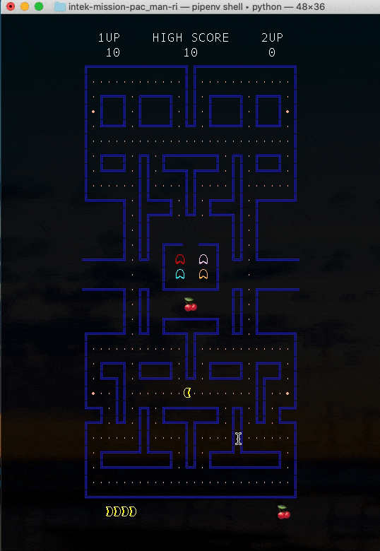
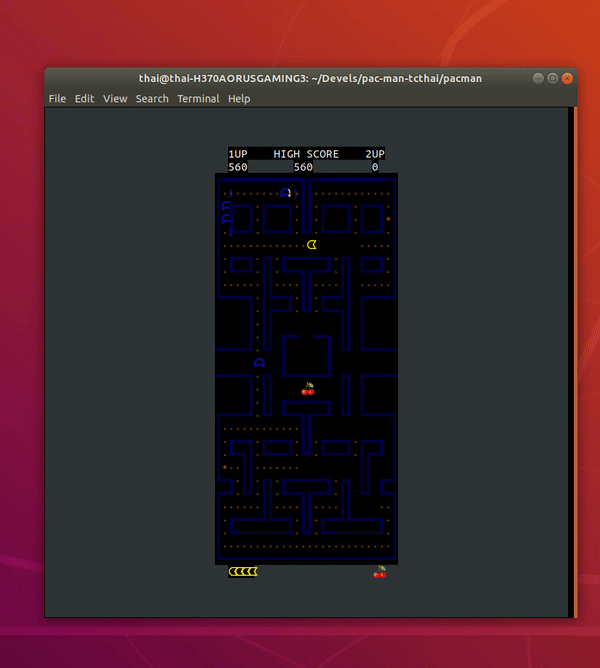
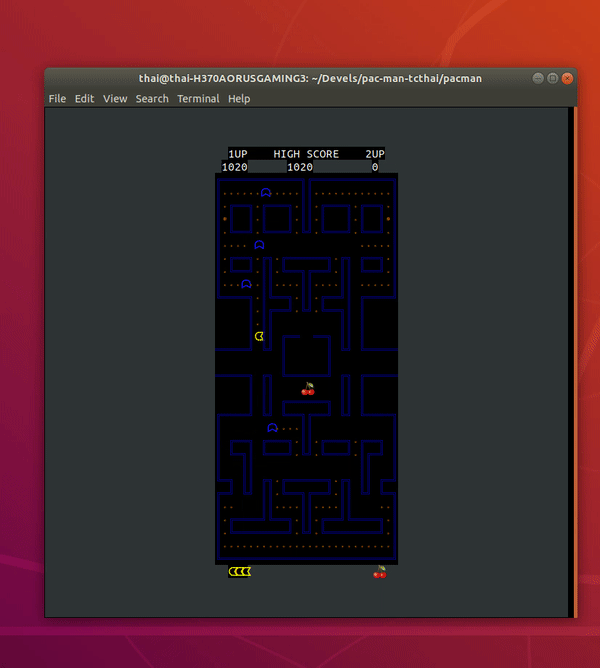
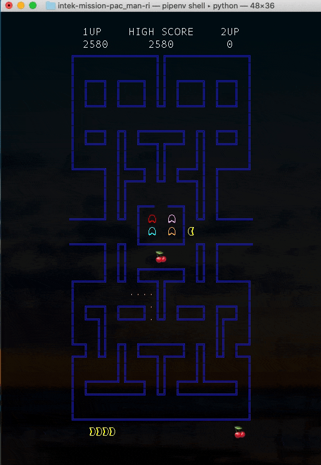

# PACMAN

## Introduction
* [This project](https://github.com/intek-training-jsc/pac-man-tcthai) aims to develop a one-level pacman game based on [the original version](https://en.wikipedia.org/wiki/Pac-Man).
* The project is developed by waypoints, each waypoint do a specific task:
    - [Waypoint 1: Load Pac-Man Map](https://github.com/intek-training-jsc/pac-man-tcthai/tree/waypoint1)
    - [Waypoint 2: Simplify Pac-Man Map](https://github.com/intek-training-jsc/pac-man-tcthai/tree/waypoint2)
    - [Waypoint 3: Convert Simplified to Human-Viewable Pac-Man Map](https://github.com/intek-training-jsc/pac-man-tcthai/tree/waypoint3)
    - [Waypoint 4: Compress Pac-Man Map with RLE](https://github.com/intek-training-jsc/pac-man-tcthai/tree/waypoint4)
    - [Waypoint 5: Save the Compressed Pac-Man Map](https://github.com/intek-training-jsc/pac-man-tcthai/tree/waypoint5)
    - [Waypoint 6: Uncompress Pac-Man Map with RLE](https://github.com/intek-training-jsc/pac-man-tcthai/tree/waypoint6)
    - [Waypoint 7: Base Class Object](https://github.com/intek-training-jsc/pac-man-tcthai/tree/waypoint7)
    - [Waypoint 8: Object Class Hierarchy](https://github.com/intek-training-jsc/pac-man-tcthai/tree/waypoint8)
    - [Waypoint 9: Class Map](https://github.com/intek-training-jsc/pac-man-tcthai/tree/waypoint9)
    - [Waypoint 10: Map Grid Representation](https://github.com/intek-training-jsc/pac-man-tcthai/tree/waypoint10)
    - [Waypoint 11: Game Level](https://github.com/intek-training-jsc/pac-man-tcthai/tree/waypoint11)
    - [Waypoint 12: Setup Pac-Man Game Engine](https://github.com/intek-training-jsc/pac-man-tcthai/tree/waypoint12)
    - [Waypoint 13: Color Palette](https://github.com/intek-training-jsc/pac-man-tcthai/tree/waypoint13)
    - [Waypoint 14: Game Scene](https://github.com/intek-training-jsc/pac-man-tcthai/tree/waypoint14)
    - [Waypoint 15: Game Loop](https://github.com/intek-training-jsc/pac-man-tcthai/tree/waypoint15)
    - [Waypoint 16: Screen Resizing](https://github.com/intek-training-jsc/pac-man-tcthai/tree/waypoint16)
    - [Waypoint 17: Score Update and Game End](https://github.com/intek-training-jsc/pac-man-tcthai/tree/waypoint17)
    - [Waypoint 18: Ghosts Leaving Home and Moving Randomly](https://github.com/intek-training-jsc/pac-man-tcthai/tree/waypoint18)
    - [Waypoint 19: Pac-Man Death](https://github.com/intek-training-jsc/pac-man-tcthai/tree/waypoint19)
    - [Waypoint 20: Eating Power Capsule](https://github.com/intek-training-jsc/pac-man-tcthai/tree/waypoint20)
    - [Waypoint 21: Standing Start Announcement](https://github.com/intek-training-jsc/pac-man-tcthai/tree/waypoint21)
    - [Waypoint 22: Maze Graph](https://github.com/intek-training-jsc/pac-man-tcthai/tree/waypoint22)
    - [Waypoint 23: Maze Weighted Graph](https://github.com/intek-training-jsc/pac-man-tcthai/tree/waypoint23)
    - [Waypoint 24: Find Shortest Path](https://github.com/intek-training-jsc/pac-man-tcthai/tree/waypoint24)

## Requirement
* The game requires python 3.8 or [later](https://www.python.org/).

## Installation
* Download from github: https://github.com/ThaiBlue/pacman.git
* Clone from github: 
```
$ git clone https://github.com/ThaiBlue/pacman.git
```
or
```
$ git clone https://github.com/ThaiBlue/pacman.git
```

## Usage
* Run the code in terminal or any python3 interpreter.
```bash
$ python3 game.py
```
* Move Pacman by pressing arrow key or 'wasd' key to eat all the dots and fruits on the map.


* If you get hit by a ghost, you will lose one life.


* After eating power capsule, you can eat ghost to gain some bonus point. 


* The game end when you press 'q' key or all the dots and bonuses gone or you lose all pacman life.



## Author
* Tran Chi Thai - student at INTEK institute of applied technology
* Email: thai.tran@f4.intek.edu.vn
* Phone: (+84) 945 577 133
